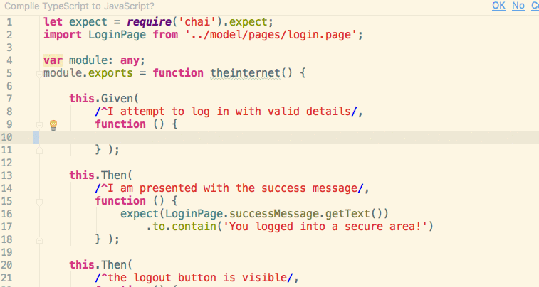

# Webdriverio
## Cucumber
### Typescript

---
## Features
```gherkin
Feature: The internet - Logging in

  Scenario: User can log in with valid details
    Given I attempt to log in with valid details
    Then I am presented with the success message
    And the logout button is visible
```
https://github.com/andrew-fowler/webdriverio-cucumber-typescript/blob/master/src/features/login.feature
---

## Step definitions
```typescript
let expect = require('chai').expect;
import LoginPage from '../model/pages/login.page';

var module: any;
module.exports = function theinternet() {

    this.Given(
        /^I attempt to log in with valid details/,
        function () {
            LoginPage.open();
            LoginPage.usernameBox.setValue("tomsmith");
            LoginPage.passwordBox.setValue("SuperSecretPassword!");
            LoginPage.loginButton.click();
        } );

    this.Then(
        /^I am presented with the success message/,
        function () {
            expect(LoginPage.successMessage.getText())
                .to.contain('You logged into a secure area!')
        } );

    this.Then(
        /^the logout button is visible/,
        function () {
            expect(LoginPage.logoutButton.isVisible());
        } );
};
```
https://github.com/andrew-fowler/webdriverio-cucumber-typescript/blob/master/src/steps/login.ts
---

## Page object model
```typescript
class Login_Page {

    public get usernameBox()  { return browser.element("//input[@id='username']") }
    public get passwordBox()  { return browser.element("//input[@id='password']") }
    public get loginButton()  { return browser.element("//button[@type='submit']") }
    public get logoutButton()  { return browser.element("//i[@class='icon-2x icon-signout']") }
    public get successMessage()  { return browser.element("//div[@class='flash success']") }
    public get errorMessage()  { return browser.element("//div[@class='flash error']") }

    public open(): void {
        browser.url('/login')
    }
}
const LoginPage = new Login_Page();
export default LoginPage
```
https://github.com/andrew-fowler/webdriverio-cucumber-typescript/blob/master/src/model/pages/login.page.ts
---
Autocompletion for Page Objects

